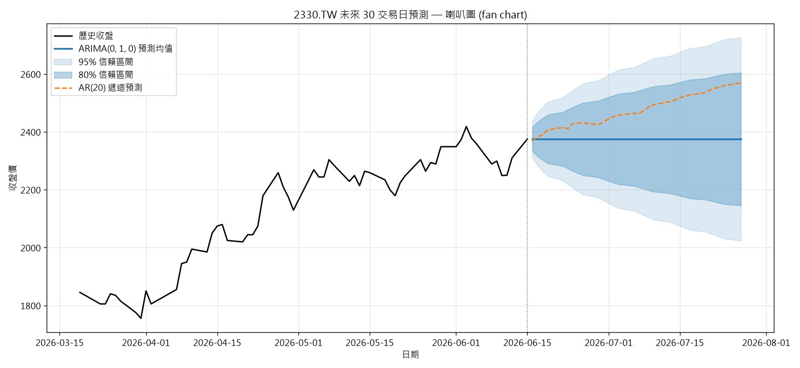

# 2330.TW 收盤價預測：AR(20) vs ARIMA

以 CRISP-DM 流程,用台積電（2330.TW）每日收盤價，比較三個單變量時間序列模型的「未來一日」預測能力。

## 模型

| 模型 | 說明 |
|---|---|
| Naive baseline | 隨機漫步:明天 = 今天(成功門檻的基準線) |
| sklearn AR(20) | 線性迴歸,以前 20 天收盤價為特徵,one-step-ahead |
| ARIMA(p,d,q) | 由 AIC 自動選階,walk-forward one-step-ahead |

**成功準則:** 一個模型「有用」的條件是它在測試集的 RMSE/MAE 要**贏過 Naive baseline**。

## 檔案

| 檔案 | 內容 |
|---|---|
| `crisp_dm_2330.py` | 完整 CRISP-DM 六階段(EDA、ADF 平穩性檢定、ACF/PACF、殘差診斷) |
| `arima_vs_ar20.py` | 精簡版比較腳本 |
| `forecast_30d.py` | 未來 30 交易日預測 + 喇叭圖(fan chart) |
| `phase2_eda.png` | 價格 / 報酬 / ACF / PACF |
| `phase5_comparison.png` | 三模型預測 vs 實際 |
| `phase5_residuals.png` | ARIMA 殘差診斷 |
| `phase6_model_metrics.csv` | 評估指標表 |
| `forecast_30d.png` / `forecast_30d.csv` | 30 日預測喇叭圖與預測表 |

## 執行

```bash
pip install -r requirements.txt
python crisp_dm_2330.py     # 完整 CRISP-DM 流程
python arima_vs_ar20.py     # 精簡比較
python forecast_30d.py      # 未來 30 日喇叭圖
```

## 未來 30 交易日預測(喇叭圖)



ARIMA(0,1,0) 預測均值為水平線(隨機漫步),信賴區間隨步數以 √步數 張開成喇叭狀;
橘虛線為 AR(20) 遞迴多步預測(誤差會累積,僅供對照)。

## 主要發現

- ADF 檢定:原始收盤價非平穩(p≈0.97),一階差分後平穩(p<0.001)→ 支持 `d=1`。
- AIC 自動選階選出 **ARIMA(0,1,0)**,本質上就是隨機漫步,因此與 Naive baseline 指標完全相同。
- **沒有任何模型贏過 Naive baseline**(成功準則:否)。AR(20) 因擬合 20 個雜訊落後項反而最差。
- 這是流動性高的股價接近隨機漫步時的合理結果——CRISP-DM 的評估階段正是用來在部署前抓出這種情況。

> ⚠️ 僅供教學/研究,非投資建議。
